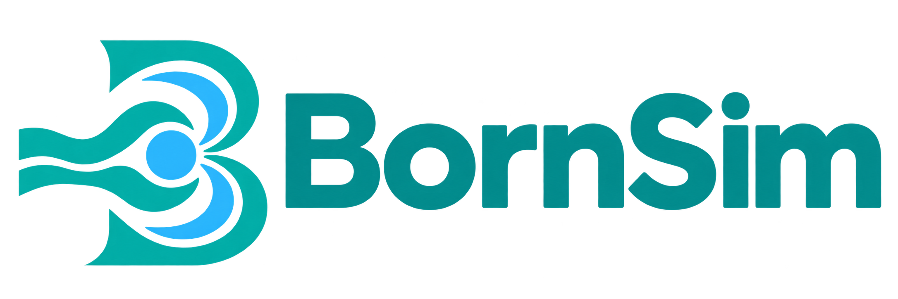

.. documentation-content-start

.. list-table::
   :widths: 35 65
   :header-rows: 1

   * - Badge
     - Status
   * - Python versions
     - |python|
   * - Documentation
     - |docs|
   * - Continuous integration
     - |tests|
   * - Static quality checks
     - |quality|
   * - Test coverage
     - |coverage|
   * - Latest release tag
     - |release|
   * - Package publication
     - |publication|
   * - License
     - |license|

BornSim
========

A Python package for vector Born-series scattering from continuous, isotropic refractive-index fluctuations, such as idealized tissue models.

Install
-------

Requires Python 3.11 or newer.

.. code-block:: console

    python -m venv .venv
    .venv/bin/python -m pip install -e .

BornSim constructor, function, and method arguments are keyword-only, except
``add_structures(*structures)``, which takes positional shape objects.
Calls with multiple arguments use one argument per line and a trailing comma.

The Python API accepts TypedUnit quantities; bare numbers use SI units. The wavelength is the **vacuum** wavelength. Outputs are angular differential scattering, μs, anisotropy g, and μs′, with scattering coefficients in inverse metres.

.. code-block:: python

    import matplotlib.pyplot as plt
    from bornsim import EnsembleSampling, Grid, RandomMedium, Source, Solver
    from bornsim.units import ureg

    grid = Grid(
        shape=(8, 8, 8),
        spacing=50 * ureg.nanometer,
    )
    medium = RandomMedium(
        background_index=1.33,
        index_std=0.01,
        correlation_length=100 * ureg.nanometer,
        correlation="gaussian",
    )
    solver = Solver(
        source=Source(wavelength=633 * ureg.nanometer),
        order=3,
    )
    result = solver.ensemble(
        medium=medium,
        grid=grid,
        ensemble_sampling=EnsembleSampling(
            realizations=4,
            seed=42,
        ),
    )
    print(result.mu_s.to("1 / millimeter"), result.g, result.mu_s_prime)
    result.plot()
    plt.show()

``Source`` describes the supported unpolarized plane wave propagating along +z.
``RandomMedium`` defines numerical random-field statistics.
``Grid`` defines spatial shape and spacing once, and is shared by
``medium.to_volume(grid=grid)`` and ``solver.ensemble(grid=grid, ...)``.
Every ``Volume`` retains its grid. ``AngularSampling`` groups output polar
angles, polar integration nodes and azimuth resolution; pass it as
``Solver(sampling=sampling, ...)`` to share settings across calculations.

``Solver.solve(target=volume)`` computes full directional scattering and
solid-angle integrals by default, providing normalized 3D phase functions
for one fixed sample. Use ``solve_cut`` with explicit ``angles`` for an x-z
angular cut, or explicit unit ``directions`` for arbitrary observations. Neither cut
supplies integrated coefficients. Angle quantities may use degrees or radians.
``Solver.ensemble(medium=medium, grid=grid, ensemble_sampling=...)`` averages
independent seeded random volumes and returns standard errors. It accepts
random media and structures with a random background. Deterministic
structures generate a volume and use ``solve`` directly.

These calculations return a ``Result`` whose ``differential`` array has
shape (order, polar angle, azimuth) for full calculations. Its ``plot()`` returns a Matplotlib figure, with
one-standard-error bars for ensembles; ``plot(terms=True)`` shows isolated
numerical terms without interference or error bars. Call ``plt.show()`` to display the figures or
``figure.savefig("scattering.svg")`` to export a figure. Full-volume and
ensemble coefficients describe finite samples and remain distinct from
infinite-medium analytical ones.
Undefined anisotropy is ``NaN`` in this object API. Existing functions and
their return formats remain available.

``result.phase_function`` normalizes every sampled direction using its full
solid-angle integral. Full ``differential`` data have shape
``(order, polar angle, azimuth)``. Curves select one sampled meridian;
``result.azimuth_average()`` explicitly requests averaged intensities.
``result.plot_phase_function(view="3d")`` preserves directional asymmetry.
For notebook rotation, install the notebook extra and use
``%matplotlib widget``. ``result.amplitudes`` retains complex amplitudes with
the same observation axes followed by polarization and Cartesian axes.
Use ``solver.solve_cut`` for unnormalized angular cuts, and
``result.plot_cross_section()`` for finite-sample area per steradian without
passing the original Volume. Saved results retain the physical sample volume.

``result.plot_field_norms()`` shows numerical field terms per realization.
See ``docs/examples/results/result_plots.py`` for direct plotting examples in the
Sphinx Gallery documentation.

Results validate array shapes and physical ranges at construction.
``result.provenance`` records calculation settings, versions, seeds, grid
and quadrature information. ``result.save(path="scattering.npz")`` and
``Result.load(path="scattering.npz")`` preserve units, complex amplitudes,
uncertainty, and metadata without pickle. Input voxel fields are not stored;
retain manually supplied fields separately. See the numerical validation
gallery for independent refinement and sampling checks.

Units
-----

``bornsim.units`` exposes TypedUnit's shared ``ureg``, ``Quantity``, ``Length``,
``Angle``, ``Dimensionless``, and ``RefractiveIndex``, using the same registry
as PyMieSim. Physical inputs accept compatible units and reject incompatible
dimensions. Bare lengths mean metres and bare angles mean radians.
``RandomMedium``, ``StructuredMedium`` and ``Volume`` normalize their inputs to numeric SI values for
the existing numerical kernels.

``Source.wavelength`` and every numerical array in ``Result`` are quantities.
Angles are stored in radians, amplitudes in metres, differential scattering
and its standard error in inverse metres per steradian, and integrated
coefficients in inverse metres. Anisotropy, direction vectors, and relative
field norms are dimensionless. Use ``.to("unit")`` to convert and
``.magnitude`` to retrieve an array. Plots convert to degrees and SI
scattering units explicitly, including uncertainty bars.

The function API also accepts quantities, while returning numeric SI arrays
and dictionaries as before. This includes ``random_volume`` voxel spacing
and ``ensemble_scattering`` wavelengths, voxel spacing, and angles.

Physical model
--------------

Real-valued index fluctuations are linearized as δε ≈ 2 n₀ δn. For an unpolarized incident wave, the differential scattering coefficient is k₀⁴ Φε(q) (1 + cos²θ)/(32π²), where q = 2 n₀ k₀ sin(θ/2), k₀ = 2π/λvac and Φε is the three-dimensional Fourier transform of the dielectric covariance without a Fourier normalization prefactor.

The index covariance is σn² exp(−r²/(2ℓ²)) for the Gaussian model and σn² exp(−r/ℓ) for the exponential model. These definitions matter when comparing correlation lengths between publications. Gauss–Legendre quadrature integrates over solid angle. Increase ``quadrature_order`` to check convergence for strongly forward-peaked scattering.

The analytical solver is a first-order, single-scattering model. The numerical solver includes repeated interactions through the chosen Born order. No slab-transmission observable or particle-packing generator is provided;
fixed particle configurations can be composed and propagated numerically. A dense medium can still have weak fluctuations; density alone does not establish Born validity. Contrast, correlation length, wavelength, and propagation distance matter. Decreasing Born terms do not certify convergence.

Scientific references:

- `Nonscalar elastic light scattering from continuous media in the Born approximation <https://pmc.ncbi.nlm.nih.gov/articles/PMC3839346/>`_.
- `Accuracy of the Born approximation in calculating the scattering coefficient of biological continuous random media <https://opg.optica.org/ol/abstract.cfm?uri=ol-34-17-2679>`_.

Check
-----

.. code-block:: console

    .venv/bin/python -m pytest tests

Tests cover the analytic short-correlation limit, contrast scaling, independent angular integration, and input validation.

Numerical media and geometry
----------------------------

``RandomMedium`` generates numerical Gaussian random fields with Gaussian,
exponential, or Whittle–Matérn spatial covariance. Matérn ``smoothness`` uses
the convention ``x = sqrt(2 * nu) * r / correlation_length``; ``nu = 0.5``
reproduces exponential covariance. ``Medium`` is an abstract base class;
instantiate ``RandomMedium`` or ``StructuredMedium`` and call ``to_volume()``.
The existing analytical statistics class is named ``AnalyticalMedium``.
Old ``Medium(...)`` calls must be replaced; choose ``correlation="gaussian"``
to preserve the former default. ``RandomMedium`` defaults to Matérn covariance.

``StructuredMedium`` voxelizes ordered ``Layer``, ``Sphere``, ``Ellipsoid``,
``Box``, and ``Cylinder`` regions. Regions specify absolute indices; later
regions replace earlier ones in overlaps. Layers are finite slabs clipped
to the box, with a uniform background outside the sample.

.. code-block:: python

    from bornsim import Grid, RandomMedium, Layer, Sphere, StructuredMedium
    from bornsim.media import random_volume
    from bornsim import Solver, Source

    random_sample = random_volume(
        medium=RandomMedium(
            correlation="matern",
            smoothness=1.5,
        ),
        grid=Grid(
            shape=(12, 12, 12),
            spacing=30e-9,
        ),
        seed=42,
    )
    structure = StructuredMedium()
    structure.add_background(index=1.33)
    layer = Layer(
        lower=-180e-9,
        upper=0,
        index=1.34,
    )

    sphere = Sphere(
        radius=70e-9,
        index=1.345,
        centre=(0, 0, 40e-9),
    )

    structure.add_structures(
        layer,
        sphere,
    )

    structured_sample = structure.to_volume(
        grid=Grid(
            shape=(12, 12, 12),
            spacing=30e-9,
        ),
    )
    solver = Solver(
        source=Source(),
        order=3,
    )

    result = solver.solve(target=structured_sample)

``Solver`` delegates numerical propagation to ``BornSeries``, which reuses
its Green operator across compatible volumes. Ensemble calculations build
one engine for all realizations. Voxel fields, random generation, Green
propagation, Born iteration, and ensemble statistics live in separate modules.

The numerical method uses a vector volume integral on cubic voxels, rather
than finite elements. The documentation's numerical theory section derives
field synthesis, geometry masks, Born orders, the Green self cell, and
scattering normalization.

Three-dimensional media
-----------------------

``Volume.plot_3d()`` defaults to an interactive Plotly volume.
``result.plot_phase_function(view="3d")`` defaults to a Plotly surface.
Select ``backend="matplotlib"`` explicitly for static 3D figures, orthogonal
slices, or sampled voxel geometry such as spheres.

.. code-block:: python

    import matplotlib.pyplot as plt
    from bornsim import Grid, RandomMedium

    medium = RandomMedium()
    volume = medium.to_volume(
        grid=Grid(
            shape=(16, 16, 16),
            spacing=25e-9,
        ),
        seed=42,
    )
    figure = volume.plot_3d(
        backend="matplotlib",
        field="delta_index",
        length_unit="nanometer",
    )
    plt.show()

Matplotlib figures rotate with an interactive backend and can be exported
with ``figure.savefig()``. The documentation gallery shows static 3D images.
Plotly is included with BornSim and is the default for 3D views. Call
``figure.show()`` for browser interaction or ``figure.write_html()`` to export
an interactive view. Angular and polar result plots use Matplotlib.
See the medium visualization documentation for units and rendering conventions.

Numerical Born series
---------------------

Generate a seeded random volume and evaluate cumulative Born orders, or average independent realizations with one-standard-error estimates. Isolated term intensities exclude interference and must not be summed to obtain cumulative intensity.

.. code-block:: python

    import numpy as np
    from bornsim import EnsembleSampling, Grid, RandomMedium
    from bornsim.series import BornSeries
    from bornsim.media import random_volume
    from bornsim.ensemble import ensemble_scattering

    medium = RandomMedium(
        index_std=0.01,
        correlation_length=100e-9,
        correlation="gaussian",
    )
    volume = random_volume(
        medium=medium,
        grid=Grid(
            shape=(12, 12, 12),
            spacing=50e-9,
        ),
        seed=42,
    )
    engine = BornSeries(
        grid=volume.grid,
        background_index=volume.background_index,
        wavelength=633e-9,
        directions=np.array([[0.0, 0.0, 1.0], [1.0, 0.0, 0.0]]),
        order=3,
    )

    result = engine.solve(volume=volume)
    # result.amplitudes[j] is the (j+1)-th term, in metres.
    # result.differential[j] includes amplitude interference through order j+1.
    ensemble = ensemble_scattering(
        medium=medium,
        wavelength=633e-9,
        order=3,
        ensemble_sampling=EnsembleSampling(
            realizations=4,
            seed=42,
        ),
    )

The API supports orders 1–12. Work limits bound synchronous calculations. Random fields have a **Gaussian probability distribution**, with Gaussian, exponential or Whittle–Matérn spatial covariance. Those are distinct choices. A spectral generator samples a doubled periodic box and crops it; ensemble point variance is normalized, but individual samples retain their random means and variances. Finite resolution truncates the spectrum, particularly for exponential covariance, and finite synthesis boxes approximate the continuum statistics.

The solver uses the outgoing dyadic background Green tensor, incident propagation along +z and an incoherent average over x/y incident polarizations. Zero-padded FFT convolution evaluates the finite-volume interactions without periodic propagation. The singular self cell uses an equal-volume sphere with the longitudinal contact term; off-diagonal cells use midpoint quadrature. This is an approximate voxel discretization, not a validated full-wave tissue simulator.

All orders use the same **linearized dielectric contrast** δε = 2 n₀ δn as the analytical model. They are perturbation orders in this dielectric contrast; the omitted δn² constitutive term is not restored by increasing Born order. Generated nonpositive dielectric values are rejected.

A first-order scattered amplitude is calculated from the incident field; subsequent amplitudes use successive applications of the Green operator. Amplitudes are summed before squaring. Ensemble averaging then averages intensities, never random amplitudes. The numerical coefficients are finite-sample cross sections divided by volume, and include the total scattered intensity; they are not automatically intrinsic infinite-medium transport coefficients. The mean anisotropy is calculated from averaged angular moments.

Numerical integration uses ``polar_samples`` Gauss nodes (default 32, range 16–128) and an azimuth count set by ``azimuth_samples`` (default 8). Plot angles are separately configurable. Check angular convergence for electrically large samples; increase ``polar_samples`` and ``azimuth_samples`` before using such samples quantitatively. Check grid refinement, sample size, synthesis-box effects and realization count as well. A single realization has unknown standard error (``NaN``). Growing field terms trigger a diagnostic; decreasing terms do not certify convergence. Modified/convergent Born series are not implemented.

Higher-order references:

- `Electromagnetic Born-series formulation and amplitude scaling <https://doi.org/10.1093/ptep/ptae008>`_.
- `Discrete-dipole and volume-integral discretization background <https://collaborate.princeton.edu/en/publications/discrete-dipole-approximation-for-scattering-calculations/>`_.
- `Modified convergent Born series, a distinct future solver <https://arxiv.org/abs/1601.05997>`_.

Regression checks compare open-boundary FFT interactions against an independently assembled dyadic matrix, compare orders 1–3 against a direct linear solve, verify per-order contrast scaling and interference, test first-order grid refinement, check random-field statistics, and verify ensemble means and standard errors.

Repository layout
-----------------

.. code-block:: text

    bornsim/             Public API, numerical solvers, Matplotlib plots
    tests/analytical/    First-order analytical regression tests
    tests/numerical/     Independent Born-series and random-field checks
    tests/packaging/     Metadata and release-tool tests
    docs/source/         Sphinx documentation
    docs/examples/       Runnable examples
    development/         Exploratory work excluded from distributions
    tools/               Release and wheel-verification commands
    conda.recipe/        Conda package recipe
    .github/workflows/   Quality, tests, documentation and publication checks

Development
-----------

.. code-block:: console

    make editable PYTHON=.venv/bin/python
    make check PYTHON=.venv/bin/python
    make docs PYTHON=.venv/bin/python
    make package-check PYTHON=.venv/bin/python
    make release-check PYTHON=.venv/bin/python

See ``CONTRIBUTING.md`` for development and release instructions. The package
uses the MIT license in ``LICENSE``; software citation metadata is provided in
``CITATION.cff``. The repository currently has no configured GitHub remote.

API configuration and data ownership
------------------------------------

Use Grid, AngularSampling and EnsembleSampling to define spatial, angular and
realization settings. Legacy individual configuration keywords are deprecated.
EnsembleSampling accepts consecutive seeds or an explicit list of distinct
seeds. Material objects share a real absolute refractive index across shapes.
Results and their arrays are read-only; StructuredMedium remains mutable.
``result.angular`` owns the directional data and is reused on every access.
``result.meridian(azimuth=90 * ureg.degree)`` selects sampled directions using
physical angles. Exact selection is the default; nearest selection must be
requested explicitly and never interpolates or averages intensities.

Theory and simulated figures
----------------------------

The documentation's theory section derives the vector volume integral, Born
orders, coherent amplitudes, phase normalization and ensemble uncertainty.
Simulated figures connect these equations to random-field covariance,
translation invariance, two-particle interference and voxel refinement.
The figures link to runnable examples and state their numerical limitations.

.. |python| image:: https://img.shields.io/badge/Python-3.11%2B-3776AB.svg
   :alt: Python 3.11 or newer
   :target: https://www.python.org/
.. |docs| image:: https://github.com/MartinPdeS/BornSim/actions/workflows/deploy_documentation.yml/badge.svg
   :alt: Documentation build status
   :target: https://martinpdes.github.io/BornSim/docs/latest/
.. |tests| image:: https://github.com/MartinPdeS/BornSim/actions/workflows/tests.yml/badge.svg
   :alt: Test status
   :target: https://github.com/MartinPdeS/BornSim/actions/workflows/tests.yml
.. |quality| image:: https://github.com/MartinPdeS/BornSim/actions/workflows/quality.yml/badge.svg
   :alt: Static quality check status
   :target: https://github.com/MartinPdeS/BornSim/actions/workflows/quality.yml
.. |coverage| image:: https://raw.githubusercontent.com/MartinPdeS/BornSim/python-coverage-comment-action-data/badge.svg
   :alt: Test coverage
   :target: https://github.com/MartinPdeS/BornSim/actions/workflows/deploy_coverage.yml
.. |release| image:: https://img.shields.io/github/v/tag/MartinPdeS/BornSim.svg
   :alt: Latest release tag
   :target: https://github.com/MartinPdeS/BornSim/tags
.. |publication| image:: https://github.com/MartinPdeS/BornSim/actions/workflows/deploy_release.yml/badge.svg
   :alt: Package publication status
   :target: https://github.com/MartinPdeS/BornSim/actions/workflows/deploy_release.yml
.. |license| image:: https://img.shields.io/github/license/MartinPdeS/BornSim.svg
   :alt: MIT license
   :target: https://github.com/MartinPdeS/BornSim/blob/master/LICENSE
